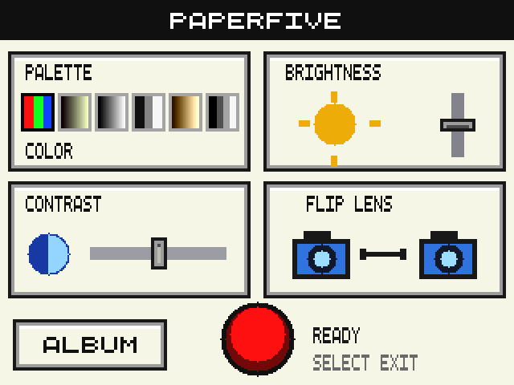

# Paperfive GBA CAM 3DS

Aplikasi kamera homebrew buatan Paperfive, terinspirasi dari Game Boy Camera.
Versi **3DS beta 1** ini merupakan port native dari desain Paperfive DSi v15.

## Download

- [Paket siap salin ke SD card](Paperfive-Camera-3DS-beta1-SD.zip?raw=true)
- [File aplikasi .3dsx](paperfive_camera_3ds.3dsx?raw=true)



## Fitur

- Preview atas **400×240**, kontrol bawah **320×240**.
- Filter, slider brightness dan contrast, flip lens, album, dan border tersedia.
- Target kamera **30 fps**, dengan double buffering dan penyimpanan JPG di
  thread terpisah agar preview tetap responsif saat menyimpan.
- Foto tersimpan di `/paperfive_camera_3ds/` pada SD card.
- Bingkai bertuliskan **NINTENDO CAMERA** tampil di preview dan JPG baru.
- Titik merah berkedip saat capture, tombol memiliki efek tekan, dan centang
  muncul setelah penyimpanan berhasil.

**Status beta:** build dan tes rendering/JPG telah lolos. Akses kamera,
kelancaran, dan sleep/resume masih perlu diuji di 3DS asli. Angka 30 fps
merupakan target pengaturan kamera, bukan hasil pengukuran di perangkat.

## Persiapan

- Nintendo 3DS/2DS yang sudah bisa menjalankan **Homebrew Launcher**.
- SD card dengan ruang kosong untuk aplikasi dan foto.
- Komputer atau pembaca SD card untuk menyalin file.

Panduan ini untuk memasang aplikasinya; tidak mencakup pemasangan custom firmware.

## Cara memasang

1. Matikan konsol sebelum melepas SD card, lalu hubungkan SD card ke komputer.
2. Download dan ekstrak `Paperfive-Camera-3DS-beta1-SD.zip`.
3. Salin folder `3ds` dari hasil ekstrak ke **root SD card**, yaitu lokasi paling
   luar kartu. Jika folder `3ds` sudah ada, gabungkan isinya; jangan mengganti
   atau menghapus seluruh folder yang sudah ada.
4. Pastikan susunannya seperti berikut:

   ```text
   SD card/
   └── 3ds/
       └── paperfive_camera/
           ├── paperfive_camera.3dsx
           └── paperfive_camera.smdh
   ```

5. Eject SD card dengan aman, pasang kembali ke konsol, lalu nyalakan.
6. Buka **Homebrew Launcher**, lalu pilih **Paperfive Pocket Camera**.

Jalankan melalui **Homebrew Launcher**, bukan TWiLight Menu. File `.3dsx`
ini bukan file `.nds` dan bukan installer `.cia` untuk HOME Menu.

## Cara memakai

| Tombol / kontrol | Fungsi |
| --- | --- |
| A atau tombol merah di layar | Ambil foto |
| L / R atau kotak palette | Ganti filter |
| Kiri / kanan | Atur contrast |
| Atas / bawah | Atur brightness |
| Geser slider di layar sentuh | Atur brightness / contrast |
| Flip Lens atau X | Ganti kamera depan / belakang |
| Album atau START | Buka album |
| Thumbnail album | Pilih foto |
| PREV / NEXT atau kiri / kanan dalam album | Ganti halaman |
| BACK, B, atau START dalam album | Kembali ke kamera |
| SELECT | Keluar ke Homebrew Launcher |

## Mengambil hasil foto

Foto baru disimpan sebagai **JPG 400×240** beserta bingkainya. Folder
`/paperfive_camera_3ds/` dibuat otomatis ketika foto pertama berhasil disimpan.
Nama file memakai waktu pengambilan dan nomor tambahan agar tidak menimpa
foto sebelumnya. Album menampilkan maksimal 128 JPG terbaru dalam folder itu.

Tunggu tanda **PHOTO SAVED** sebelum keluar. Untuk mengambil file, keluar dari
aplikasi, matikan konsol, lalu baca SD card di komputer. Buka folder
`paperfive_camera_3ds` dan salin JPG yang diinginkan.

## Jika menemui masalah

- **Aplikasi tidak muncul:** cek susunan folder dan pastikan file ZIP sudah
  diekstrak. Jalankan Homebrew Launcher, bukan menu DS.
- **CAMERA ERROR / CAMERA UNAVAILABLE:** coba X atau Flip Lens. Jika tetap
  gagal, keluar dan buka ulang; catat model konsol dan kamera mana yang gagal
  untuk laporan pengujian beta.
- **SAVE FAILED:** cek ruang kosong SD card dan pastikan kartu dapat ditulis.
- **Album kosong:** pastikan capture sudah menampilkan PHOTO SAVED. Album 3DS
  membaca folder `paperfive_camera_3ds`, bukan folder foto versi DSi.

Paperfive Pocket Camera adalah proyek homebrew independen, bukan aplikasi
resmi Nintendo.
