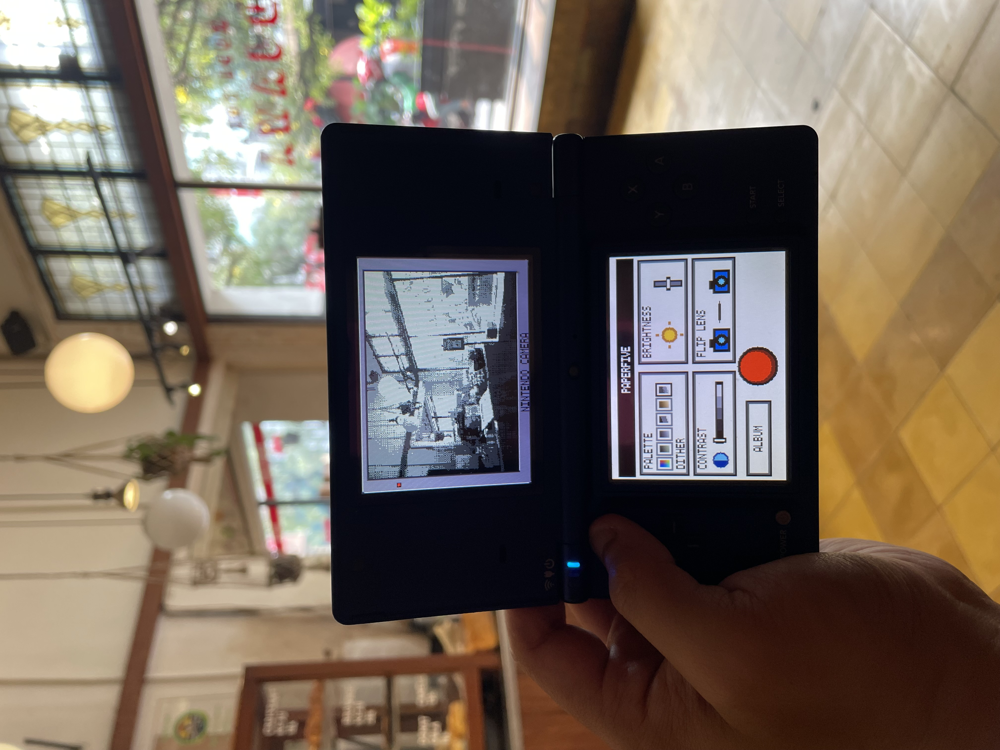
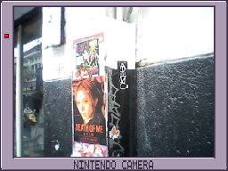
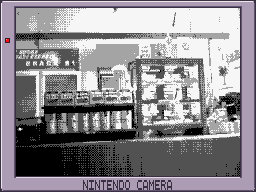
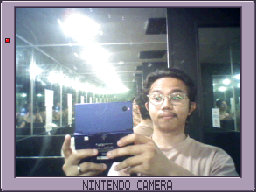

# Paperfive Camera — DSi & 3DS

Kamera homebrew bergaya Game Boy Camera. Pilih versi sesuai konsol:

## Preview penggunaan — DSi

[▶ Lihat demo penggunaan di Instagram](https://www.instagram.com/p/DdGMXxQzSZc/)

### Contoh hasil foto

Hasil foto dari versi DSi, dengan bingkai NINTENDO CAMERA.

  
  
  

## Download

| Konsol | Download | Tutorial |
| --- | --- | --- |
| Nintendo DSi / DSi XL | [DSi v15 (.nds)](dsi/paperfive_pocket_camera-v15.nds?raw=true) | [Panduan DSi](dsi/README.md) |
| Nintendo 3DS / 2DS | [3DS beta 1 (ZIP siap SD)](3ds/Paperfive-Camera-3DS-beta1-SD.zip?raw=true) | [Panduan 3DS](3ds/README.md) |

DSi: jalankan melalui TWiLight Menu++ dalam **DSi mode**. 3DS: jalankan melalui **Homebrew Launcher**, bukan TWiLight Menu.

Folder foto berbeda: DSi `/paperfive_camera/`, 3DS `/paperfive_camera_3ds/`.

Versi 3DS masih beta; kamera dan performa di perangkat asli belum terverifikasi. Proyek independen, bukan aplikasi resmi Nintendo.
